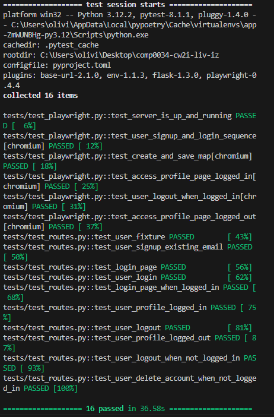

# Quick Info

My app could fall under the other category as it is a flask app that embraces the dashboard theme whilst trying to be more than that. I wanted to take the Flask route as I felt this would give me more to learn and more applicable to my future. In this app, I implement authentication and dashboards. I chose to use the Highcharts library as I wanted to use my API from coursework 1 to get the data and then interact with it in the frontend. I had to make some changes to the models as these in the end had to hold different data than I originally intended them to (as I did not go with the dash route) and change some API calls to be dynamic, using url queries to hold parameters.

As a result my app has a page where the user can download the dataset used for the dashboards or access the raw data link, a profile page, a signup page, a login page, a home page with three maps that any user can interact with and a map creation page where the user can create a map and save it to their user profile. I was particularly interested in how to dynamically generate the map using queries which could hold parameters that could then be stored in the backend. The user can also delete their account.

I used playwright for my tests as I found the library more comprehensive and detailed and the playwright install already installed chrome drivers which would have had to have been done in a second step with selenium. I once again used poetry for dependency management. If you run the script from the moodle zip, then the folder will already contain an instance of the project.db with the data in it. If the code is run from github, then please run the load_dataset script prior to testing the app (as no data will be returned otherwise). 

Moreover, to make the frontend load faster, the geometry data is statically served as a .json file. I hope you like the website- I strongly encourage checking out the 404 page, which is still my favourite to date!

Please refer to https://python-poetry.org/docs/basic-usage/ on how to use poetry for an existing project.

To run the app please first load the data into the database using the data_migration.py file in the scripts folder. After that, you can F5 to run the app or run "poetry run pytest" to run the tests. 

If running from the zip file in moodle, the db instance should be there already.

Evidence of tests passing:

